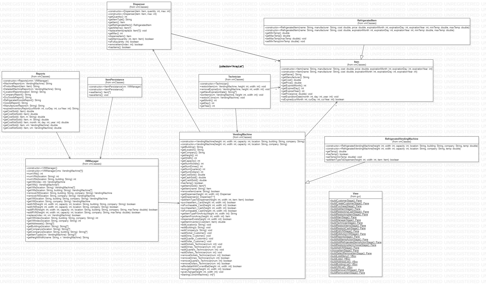
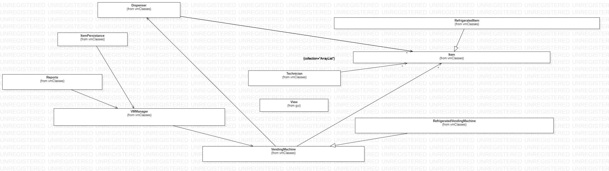
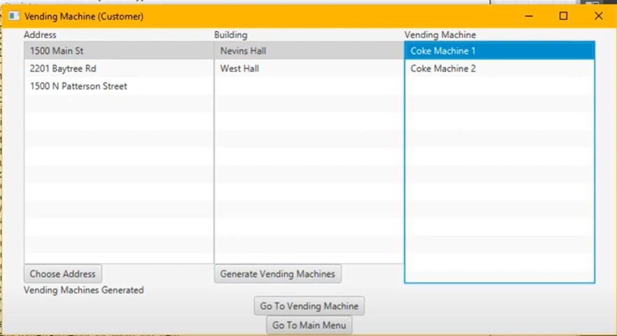
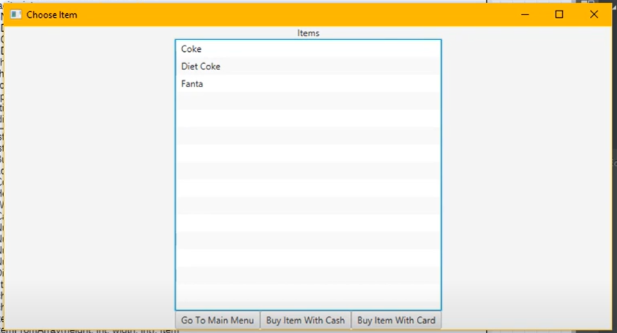
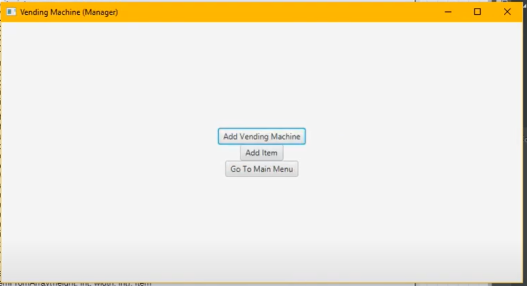
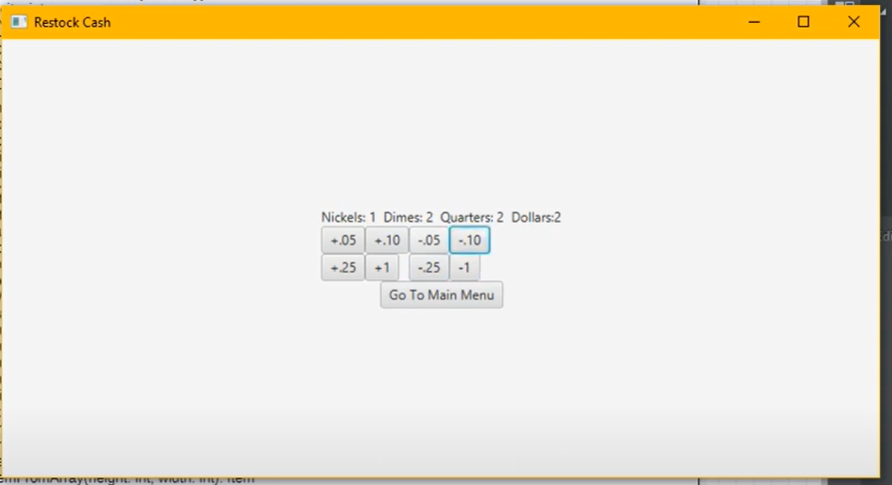

# This is the Vending Machine Project that my team and I work on together.

### Team members: 
- [Sean]
- [Greg]
- [David Tan](https://github.com/skytruong90)
- [Alex]
- [Nathan]

## Here is a Live Demo:
https://youtu.be/zb6YhU2T2x8

https://youtu.be/1VUPADGI0zQ

## How to install:
1. Clone the repository: https://github.com/skytruong90/Vending_Machine_GUI.git
2. The main code and everything is inside a folder called `code`
3. Cd to `code`
4. Make sure you have all of Java SDK and IDE installed properly 
5. Run it on Eclipse, VS code, Jgrasp, etc.

## Our Objective: To create a GUI based system that allows a user to manage a vending machine, where they can add products, remove product, purchase products, add money, add location, and other fun stuffs.

## This is the class diagram that explain the layout of the project:

## This is the main interface of the GUI, where you can: add money, add location, add building, add products, etc:

